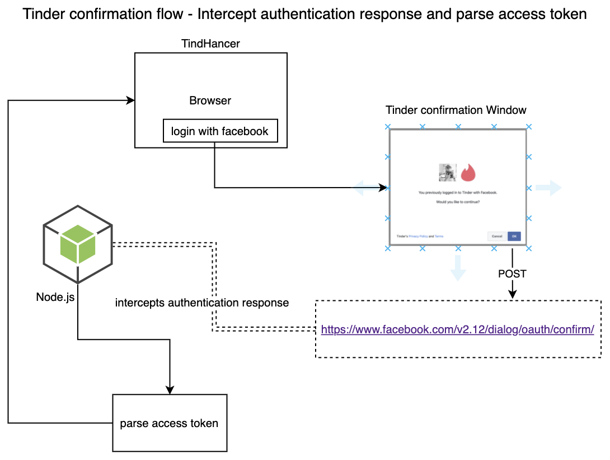

## UpWork Task - Authenticate Tinder API using FB Access token

Create an authentication mechanism that can obtain facebook access token to be used for authentication with Tinder based app - http://tindhancer.com/

Preference is given to the following solution
{:height="70%"}

Once token is retrieved, store it in the local storage.

To test the correct access Token place it as into the POST body:

```
curl --location --request POST 'https://api.gotinder.com/v2/auth/login/facebook' \
--header 'Accept: application/json' \
--header 'Content-Type: application/json' \
--header 'platform: web' \
--header 'User-Agent: Mozilla/5.0 (Macintosh; Intel Mac OS X 10_12_6) AppleWebKit/537.36 (KHTML, like Gecko) Chrome/77.0.3865.90 Safari/537.36' \
--header 'Content-Type: application/json' \
--data-raw '{"token": "%FACEBOOK_ACCESS_TOKEN%"}'
```

to get simular response:

```
{
    "meta": {
        "status": 200
    },
    "data": {
        "_id": "9e68ceffb2fbde0100dfe1k2",
        "api_token": "7705c759-ac26-4bd3-942d-d6cbahheaf6c",
        "refresh_token": "eyJhbGciOpnIUzI1NiJ9.ODEzMjM5ODI5MTYwNDAw.sOZ1HTWNiZxzoG-GnNVYo5PK27Flj8Afslz2T669kHU",
        "is_new_user": false
    }
}
```

### Helpful Links & Resorses

[Getting access token](https://gist.github.com/taseppa/66fc7239c66ef285ecb28b400b556938)

[Tinder web based app](https://tinder.com/)

---

This project was bootstrapped with [Create React App](https://github.com/facebook/create-react-app).

## Available Scripts

In the project directory, you can run:

### `yarn start`

Runs the app in the development mode.<br />
Open [http://localhost:3000](http://localhost:3000) to view it in the browser.

The page will reload if you make edits.
